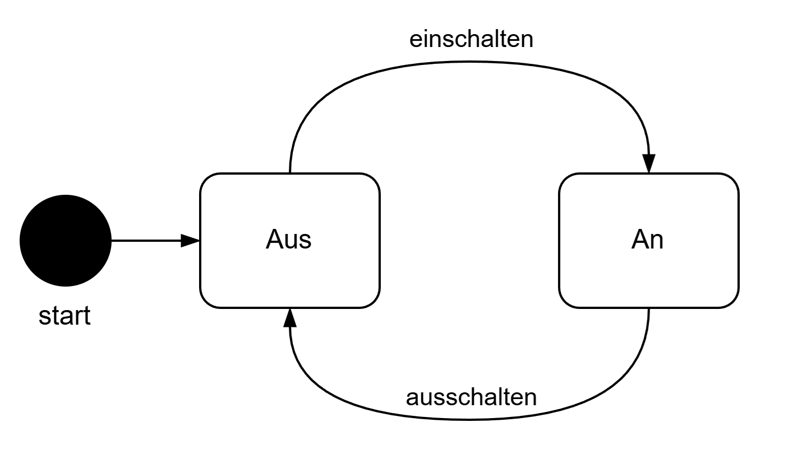
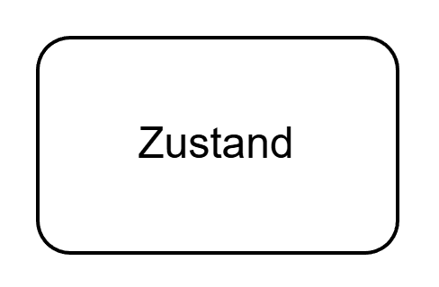
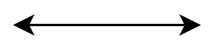
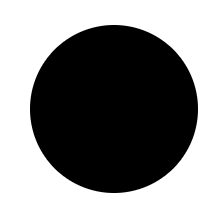
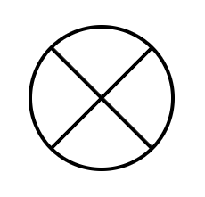
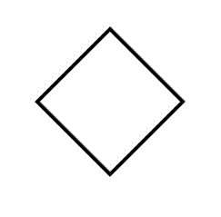

# UML-Diagramme

| Diagrammtyp | Kategorie | Zweck | Hauptbestandteile | Anwendungsbereich |
| --- | --- | --- | --- | --- |
| Klassendiagramm | Struktur | Aufbau von Klassen und Beziehungen | Klassen, Attribute, Methoden, Beziehungen | Für Software-Architektur und Design |
| Objektdiagramm | Struktur | Momentaufnahme konkreter Objekte | Objekte, Werte, Links | Zum Testen/Verstehen von Klassendiagrammen |
| Komponentendiagramm | Struktur | Software-Komponenten und Abhängigkeiten | Komponenten, Schnittstellen | Bei größeren Systemarchitekturen |
| Verteilungsdiagramm (Deployment) | Struktur | Physische Verteilung von Software | Knoten, Artefakte | Für Infrastruktur & Deployment |
| Paketdiagramm | Struktur | Organisation von Modulen | Pakete, Abhängigkeiten | Bei großen Codebases |
| Anwendungsfalldiagramm | Verhalten | Funktionen aus Nutzersicht | Akteure, Use Cases | Für Anforderungen |
| Sequenzdiagramm | Verhalten | Ablauf von Nachrichten | Objekte, Nachrichten, Zeitachse | Für Prozessabläufe |
| Aktivitätsdiagramm | Verhalten | Workflows/Prozesse | Aktionen, Entscheidungen | Für Geschäftsprozesse |
| Zustandsdiagramm | Verhalten | Zustandsänderungen eines Objekts | Zustände, Übergänge | Für komplexe Logik |
| Kommunikationsdiagramm | Verhalten | Interaktionen (strukturierter) | Objekte, Nachrichten | Alternative zu Sequenzdiagramm |
| Zeitdiagramm | Verhalten | Zeitliche Abläufe | Zustände über Zeit | Bei Echtzeitsystemen |

Folgende UML-Symbole werden oft genutzt:

| Symbol | Bezeichnung | Bedeutung |
| --- | --- | --- |
|  | Zustandsautomat | Ein Diagramm, das Zustände eines Systems und Übergänge zwischen ihnen darstellt; zeigt, wie das System auf Ereignisse reagiert. |
|  | Zustand | Ein möglicher Status eines Objekts oder Systems, in dem es sich bis zum Auftreten eines Ereignisses befindet. |
|  | Transition | Ein Übergang von einem Zustand in einen anderen, ausgelöst durch ein Ereignis oder eine Bedingung. |
|  | Startzustand | Der Anfangszustand eines Zustandsautomaten, oft mit einem gefüllten Kreis dargestellt. |
|  | Endzustand | Der Endzustand eines Zustandsautomaten, meist mit einem Kreis mit Punkt in der Mitte oder einem durchgestrichenen Kreis dargestellt. |
|  | Entscheidung | Ein Verzweigungspunkt, an dem anhand einer Bedingung der nächste Übergang gewählt wird. |